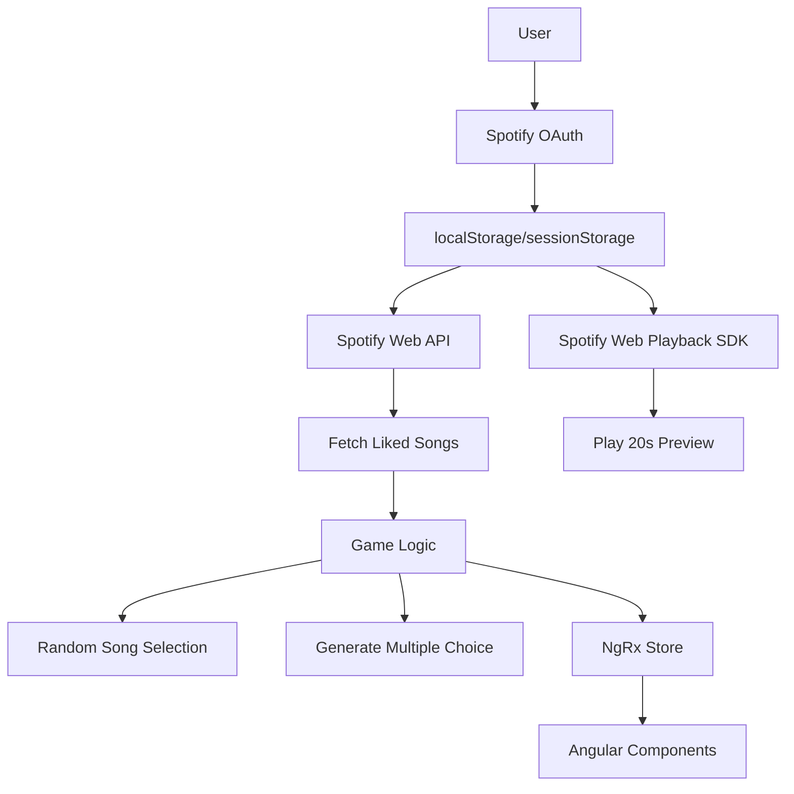
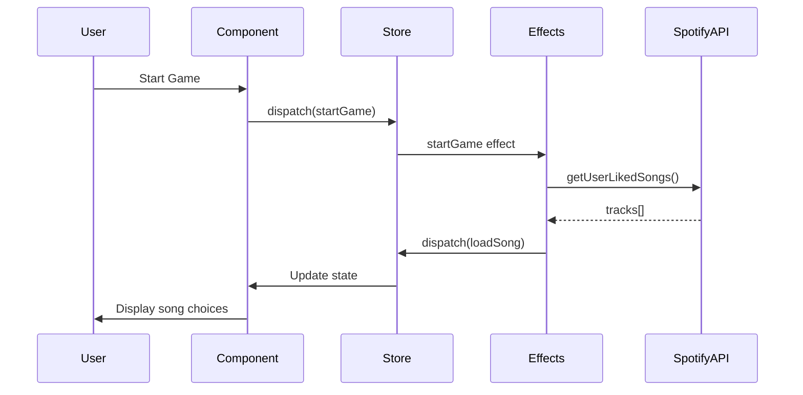

<!-- dcc0347a-ce4e-4116-b4c3-18815e09e315 d20597d1-0d85-4ce9-a4a0-df4de98a79a5 -->
# Spotify Music Guessing Game

## Architecture Overview



## Technology Stack

- **Framework**: Angular (latest stable version)
- **State Management**: NgRx (Store, Effects, Actions)
- **Authentication**: Spotify OAuth 2.0 with PKCE flow
- **Audio**: Spotify Web Playback SDK
- **Styling**: Mobile-first responsive CSS (consider Angular Material or Tailwind)
- **Storage**: localStorage for OAuth tokens

## Project Structure

```
code/
├── src/
│   ├── app/
│   │   ├── core/
│   │   │   ├── services/
│   │   │   │   ├── spotify-auth.service.ts
│   │   │   │   ├── spotify-api.service.ts
│   │   │   │   └── spotify-playback.service.ts
│   │   │   └── guards/
│   │   │       └── auth.guard.ts
│   │   ├── store/
│   │   │   ├── auth/
│   │   │   │   ├── auth.actions.ts
│   │   │   │   ├── auth.reducer.ts
│   │   │   │   ├── auth.effects.ts
│   │   │   │   └── auth.selectors.ts
│   │   │   ├── game/
│   │   │   │   ├── game.actions.ts
│   │   │   │   ├── game.reducer.ts
│   │   │   │   ├── game.effects.ts
│   │   │   │   └── game.selectors.ts
│   │   │   └── app.state.ts
│   │   ├── features/
│   │   │   ├── auth/
│   │   │   │   ├── login/
│   │   │   │   └── callback/
│   │   │   ├── game/
│   │   │   │   ├── game-setup/
│   │   │   │   ├── game-play/
│   │   │   │   └── game-results/
│   │   ├── shared/
│   │   │   ├── models/
│   │   │   └── components/
│   │   └── app.routes.ts
│   ├── environments/
│   │   ├── environment.ts
│   │   └── environment.prod.ts
│   └── assets/
├── angular.json
├── package.json
└── tsconfig.json
```

## Environment Variables

Create `environment.ts` with:

- `SPOTIFY_CLIENT_ID`: Spotify app client ID
- `SPOTIFY_REDIRECT_URI`: OAuth callback URL
- `SONG_PREVIEW_DURATION`: Duration in seconds (default: 20)
- `SONGS_PER_GAME`: Number of songs per game session (default: 10)

## Implementation Phases

### Phase 1: Project Setup & Spotify Authentication

1. Initialize Angular project with routing and NgRx
2. Install dependencies: `@ngrx/store`, `@ngrx/effects`, Spotify Web Playback SDK types
3. Implement Spotify OAuth 2.0 PKCE flow:

   - Auth service to handle login/logout
   - Token storage in localStorage (with expiry handling)
   - Auth guard to protect game routes
   - Callback component to handle OAuth redirect

4. Create NgRx auth store (actions, reducer, effects, selectors)

### Phase 2: Spotify API Integration

1. Create Spotify API service with methods:

   - `getUserLikedSongs()`: Fetch all liked songs (handle pagination)
   - `getTrack(id)`: Get specific track details

2. Design extensible music source interface:
```typescript
interface MusicSource {
  type: 'liked-songs' | 'playlist' | 'album'; // Future: add more types
  fetchTracks(): Observable<Track[]>;
}
```

3. Implement `LikedSongsMusicSource` (keep architecture open for future playlist/album sources)

### Phase 3: Spotify Web Playback SDK Integration

1. Load Spotify Web Playback SDK script
2. Create playback service:

   - Initialize player with OAuth token
   - Play track from specific timestamp
   - Control playback (play/pause/stop)
   - Handle playback events

3. Implement 20-second preview timer (configurable from environment)

### Phase 4: Game Logic & NgRx Store

1. Create game state models:
```typescript
interface GameState {
  currentRound: number;
  totalRounds: number;
  score: number;
  currentSong: Track;
  titleChoices: string[];
  artistChoices: string[];
  gameMode: 'easy' | 'hard';
  gameStatus: 'setup' | 'playing' | 'answered' | 'finished';
}
```

2. Implement game actions (start game, load song, submit answer, next round, end game)
3. Create game effects:

   - Load random song from liked songs
   - Generate 4 multiple choice options (1 correct + 3 similar from same library)
   - Calculate score based on correctness and time

4. Implement answer validation logic

### Phase 5: UI Components (Mobile-First)

1. **Login Screen**: Spotify login button with branding
2. **Game Setup Screen**: 

   - Difficulty selection (Easy/Hard toggle)
   - Start game button
   - Display configured songs per game

3. **Game Play Screen**:

   - Progress indicator (e.g., "Song 3/10")
   - Current score display
   - Audio playback controls & timer (countdown from 20s)
   - **Easy Mode**: Two sets of 4 buttons each (title choices + artist choices)
   - **Hard Mode**: Two text input fields (title + artist)
   - Submit button (touch-friendly, large)
   - Feedback display (correct/incorrect with correct answer)

4. **Game Results Screen**:

   - Final score
   - Percentage correct
   - Play again button

5. Make all components touch-friendly (min 44x44px touch targets)

### Phase 6: Styling & Responsiveness

1. Implement mobile-first CSS with responsive breakpoints
2. Add loading states and spinners
3. Add animations for feedback (correct/incorrect)
4. Ensure accessibility (ARIA labels, keyboard navigation)
5. Test on various mobile screen sizes

### Phase 7: Testing & Polish

1. Test OAuth flow and token refresh
2. Test game logic with various scenarios
3. Handle edge cases:

   - User has fewer than 10 liked songs
   - Playback SDK initialization failures
   - Network errors during API calls

4. Add error handling and user-friendly error messages
5. Optimize performance (lazy loading, change detection)

## Key Technical Decisions

**Music Selection Algorithm**:

- Randomly select N songs from liked songs library (no duplicates in same game)
- For multiple choice generation: randomly pick 3 other songs from the same library
- Architecture allows future extension to playlists/albums via `MusicSource` interface

**State Management Flow**:



**Answer Validation**:

- Easy mode: Exact match on selected choices
- Hard mode: Fuzzy string matching (case-insensitive, trim whitespace, ignore special characters)
- Award points: Full points for correct, 0 for incorrect
- Track both title and artist separately

## Future Extension Points

- `MusicSource` interface allows adding playlist/album selection
- Game modes can be extended (time attack, survival, etc.)
- Scoring system can be enhanced (time-based bonus, streak multipliers)
- Multiplayer support via WebSocket (requires backend)

### To-dos

- [x] Initialize Angular project with NgRx, routing, and dependencies
- [x] Implement Spotify OAuth 2.0 PKCE flow with token storage
- [x] Create NgRx auth store (actions, reducer, effects, selectors)
- [x] Create Spotify API service with liked songs fetching
- [x] Integrate Spotify Web Playback SDK for audio playback
- [ ] Create NgRx game store with game logic and answer validation
- [ ] Implement random song selection and multiple choice generation
- [ ] Build login screen component
- [ ] Build game setup screen with difficulty selection
- [ ] Build game play screen with easy/hard modes
- [ ] Build game results screen with score display
- [ ] Apply mobile-first responsive styling to all components
- [ ] Test all features, handle edge cases, and polish UX